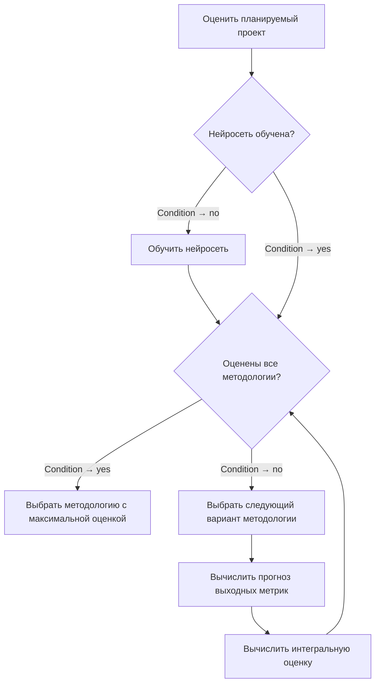

SCIENCE PROSPECTS. № 6(177).2024.
12
INFORMATION TECHNOLOGY
System Analysis, Control and Information Processing
УДК 004.4’2:004.415.53
МЕТОДОЛОГИИ РАЗРАБОТКИ ПРОГРАММНОГО ОБЕСПЕЧЕНИЯ: АНАЛИЗ И КЛАССИФИКАЦИЯ
Д.А. ГУРЬЯНОВ, Г.И. АФАНАСЬЕВ, А.Г. АФАНАСЬЕВ
ФГБОУ ВО «Московский государственный технический университет имени Н.Э. Баумана (национальный исследовательский университет)», г. Москва
Ключевые слова и фразы: жизненный цикл; методологии разработки программного обеспечения; гибкая разработка; классификация; инновационный менеджмент.
Аннотация: В статье рассмотрены основные модели жизненного цикла (ЖЦ) и методологии разработки программного обеспечения, созданные на их основе. Определено место методологий и их роль в процессе управления разработкой программного обеспечения, выявлены различия и отношения между ними, а также степень влияния на успешность реализации проекта. В работе использованы общенаучные методы исследования. Проведен обзор критериев сравнения методологий разработки ПО. Проанализированы существующие способы однокритериальной и двухкритериальной классификации методологий и выявлены их недостатки. Представлены новые способы однокритериальной классификации, устраняющие выявленные недостатки. Разработан новый вариант многокритериальной классификации на основе четырех критериев, предлагающий более полное и широкое иерархическое распределение моделей жизненного цикла и методологий разработки программного обеспечения. Рассмотрены существующие методы выбора методологии разработки программного обеспечения, а также представлен собственный метод, основанный на ретроспективном анализе и методах машинного обучения.

Введение
Процесс управления моделью жизненного цикла способствует тому, чтобы гарантировать пригодность модели, процессов и практик ЖЦ для использования организацией [1]. Этот процесс обеспечивает успешный выбор, реализацию, поддержку и адаптацию процессов ЖЦ, а также применение обоснованных методов и набора инструментов. Одним из способов решения задачи организации процессов на предприятии является выбор одной или нескольких готовых методологий разработки и развертывание процессов согласно руководствам по внедрению конкретных методологий.
Тем не менее, ввиду нематериального характера предмета разработки, процесс разработки программного обеспечения связан с высокой долей риска не завершить разработку проекта в срок. Согласно исследованиям Standish Group [2], по состоянию на 2020 г., только 31 % проектов в области разработки программного обеспечения признаны успешными. Одним из ключевых факторов [3], влияющих на высокий процент провальных проектов и завершенных с затруднениями, является неправильный выбор методологии разработки при запуске проекта.
Правильный выбор методологии на ранних этапах развития проекта является одним из ключевых мероприятий, способствующих успешности реализации проекта. На сегодняшний день у менеджеров проекта имеется более 50 возможных вариантов выбора методологии, которые различаются между собой используемой моделью жизненного цикла, ценностной ориентацией, адаптацией к размерам проекта, сроками поставки целевого продукта, составом практик разработки и пр. Такое большое количество вариантов выбора в совокупности с отсутствием достаточного количества литературных источников, слабым уровнем покрытия (литературные источники концентрируются только на нескольких из большого числа доступных вариантов) и низким уровнем формализации процесса определения наиболее актуальной методологии, когда ее выбор осуществляется только на основании предыдущего опыта менеджера проекта и ведет к увеличению риска неправильного выбора методологии, что, в свою очередь, уменьшает вероятность успешного завершения проекта [2; 3].

Так как для решения задачи выбора методологии разработки необходимо понимать сходства и различия, в данной статье мы рассмотрим существующие методологии разработки ПО, рассмотрим их ключевые характеристики, изучим существующие методы классификации и разработаем новые способы классификации, что позволит улучшить процедуру выбора оптимальной методологии и адаптировать ее под конкретные условия, действующие на предприятии, что, в свою очередь, поможет оптимизировать весь процесс управления моделью жизненного цикла в контексте предприятия.

## Литературный обзор

Вопрос выбора правильного подхода к организации жизненного цикла разработки программного обеспечения стоит перед исследователями с самых первых лет существования такой дисциплины как программная инженерия. Одна из ключевых работ, посвященных этой теме, в которой оцениваются недостатки использования каскадного подхода, применяемого некоторыми практиками, где предлагается модифицированная каскадная модель жизненного цикла, была опубликована У. Ройсом [4]. Работы Х. Мооза и К. Форсберга [5; 6], Б.В. Босма [7] содержат результаты дальнейших исследований возможности использования каскадного подхода и модифицированной каскадной модели на практике, где авторы предложили новые модели жизненного цикла разработки программного обеспечения.
Дальнейшее развитие проблема моделей ЖЦ ПО получила в работах К. Швабера [8], Дж. Стэплтона [9], К. Бека [10] и С.В. Эмбера [11], посвященным гибким методологиям разработки программного обеспечения, возникшим на рубеже тысячелетий и бросившим вызов традиционным подходам к разработке программного обеспечения. Публикация манифеста гибкой разработки привела к появлению большого количества методологий, описанных в работе В.М. Фонта [12], и привела к проблеме выбора наиболее эффективной в зависимости от ситуации, описанной в работе А. Кокберна [13]. Процедура выбора методологии дополнительно осложняется тем, что она чаще всего не формализована в рамках конкретной организации [3]. В. Озтокр [3] в своей статье описал решение этой проблемы с применением многокритериальных экспертных методов, таких как метод анализа иерархий [14], MAUT [15], ELECTRE [16] или вербальный анализ решений (ВАР) [17].
Несмотря на высокое качество результатов работы, эти методы требуют серьезных затрат времени и серьезной подготовки руководителя проекта для принятия решения. Чтобы обойти эти ограничения, были придуманы специализированные методы принятия решений выбора методологии разработки ПО, описанные в работах В. Озтокра [3] и А. Диллмана [18]. В следующих параграфах представлен краткий обзор основных идей этих методов.

## А. Экспертные системы на основе правил

Данные системы представляют собой программную реализацию алгоритма, состоящего из набора вложенных условных операторов [3]. Во время выполнения процедуры выбора методологии разработки ПО пользователю необходимо ответить на последовательно задаваемые вопросы, ответы на которые влияют на выбор ветви алгоритма. В качестве недостатков данного метода можно выделить плохую приспособленность к выбору из близкородственных вариантов методологий, таких как методологии семейства Crystal, где основным критерием выбора из восьми вариантов является нестрогое ограничение по количеству участников в команде разработки.

## В. Куб принятия решений Диллмана

В своей работе A. Dillman [18] предложил способ выбора методологии на основе графической модели расположения вариантов выбора в трехмерном пространстве. В качестве исходной идеи он использовал треугольник управления проектами PMBoK, который описывает идею тройственной ограниченности проекта и баланса между содержанием проекта (функциональностью), стоимостью (бюджетом) и сроками реализации (временем). Каждая из сторон треугольника управления преобразовывается в пространство трехмерной системы координат, в которой размещаются возможные варианты выбора. Менеджеру проекта остается выбрать вариант, находящийся в интересующей его точке пространства. Данный метод позволяет принимать решения в условиях высокой неопределенности и отсутствия данных о предыдущих реализациях аналогичных проектов у команды разработки, однако рассматривает гибкие методологии в качестве единого целого. Тем не менее существенные различия в составе практик и ценностей гибких методологий могут повлиять на каждый из факторов успешности реализации проекта.

## C. Выбор методологии на основе нечеткой логики

В своей работе V. Ozturk и коллеги [3] представили способ, который на основании таких характеристик проекта, как «Размер проекта», «Опыт команды», «Сложность», «Стабильность требований», «Риски проекта», может осуществить выбор модели жизненного цикла при помощи модели нечеткой логики.
Данная модель основывается на правилах, разработанных в результате проведения сравнительного анализа возможных вариантов выходных значений и весах правил, устанавливаемых в ходе работы менеджеров проекта индивидуально. Данная модель может эффективно предсказывать удачную методологию на самых ранних этапах проекта (даже до его начала), так как в качестве входных параметров используются лингвистические переменные, представленные в виде отдельных слов или фраз, описывающих различные характеристики качества проекта на понятном человеку языке в виде степеней уверенности и относительных величин. В таком виде данные о проекте понятны менеджеру еще до запуска проекта. Данный способ может быть масштабирован для принятия решения о выборе конкретной методологии, однако их число будет ограничено границами применимости модели нечеткой логики. Согласно рекомендации автора метода, допустимое число правил, при которых модель может дать адекватный результат, составляет не более 15, что не позволит описать все необходимые отличия близкородственных гибких методологий.
Большое количество вариантов побудило исследователей изучить детали и выявить общие черты сравнения, которые могли бы лечь в основу классификации методологий. В своих статьях D. Ciric et al. [19] предложили варианты классификации на основе одного критерия – гибкость процесса, а Z. Ahmed et al. [20] предоставили свои варианты в зависимости от размера команды. М. Фаулер [21] предложил вариант двухкритериальной классификации, основанный на наложении двух проекций однокритериальных классификаций в виде двумерной системы координат.
Аналогичное исследование было опубликовано А. Кокберном [13], где в качестве критериев были выбраны размер команды и риски проекта. Такие классификации обычно используются как самостоятельные инструменты для выбора методологии разработки программного обеспечения или для уменьшения количества нерелевантных вариантов в комплексном подходе.
Эти идеи более подробно обсуждаются далее в этой статье.

Жизненный цикл разработки программного обеспечения
Период существования программной системы, который начинается с момента замысла, продолжается в течение эволюции и заканчивается утилизацией программной системы называется жизненным циклом (ЖЦ) программной системы [22]. В качестве концептуальной основы, используемой для организации и управления разработкой, функционированием, сопровождением и утилизацией программных систем, были разработаны моделей жизненного цикла программных систем. Большинство из них многократно детально изучались, в данной статье основное внимание будет уделено следующим моделям:
– неструктурированная разработка («взрывное проектирование») [4];
– анализ-кодирование [4];
– каскадная (Waterfall) [4; 12];
– модифицированная каскадная [4; 12];
– V-образная [5];
– W-образная [6];
– инкрементальная [23];
– итерационная [23];
– спиральная [7].
На протяжении реализации проекта модели жизненного цикла уточняются конкретными методологиями разработки, представляющими собой свод правил, практик, методов и инструкций, способствующих успешной реализации проекта.
Как было сказано выше, у руководителей проектов есть более 50 вариантов выбора методологий разработки. авторы гибких методологий путем введения ограничения на размер команды, как в *Scrum*, и разработки специальных фреймворков для управления большими проектными командами, например, *LeSS*.

### Таблица 1. Фрагмент финальной таблицы сравнения методологий разработки ПО

| Методология                   | Частичная поставка | Управление рисками | Управление требованиями | Прототипирование | Применение C4ISR-средств | Повторное использование | Ежедневные стенды |
| ----------------------------- | ------------------ | ------------------ | ----------------------- | ---------------- | ------------------------ | ----------------------- | ----------------- |
| Взрывное проектирование       |                    |                    |                         |                  |                          |                         |                   |
| Анализ-кодирование            |                    |                    |                         |                  |                          |                         |                   |
| Кодирование-отладка           |                    |                    |                         |                  |                          |                         |                   |
| Каскадная                     |                    |                    |                         |                  |                          |                         |                   |
| Модифицированная каскадная    |                    | ✓                  | ✓                       |                  |                          |                         |                   |
| V-образная                    |                    | ✓                  | ✓                       | ✓                |                          |                         |                   |
| W-образная                    |                    | ✓                  | ✓                       | ✓                |                          |                         |                   |
| Спиральная                    | ✓                  | ✓                  | ✓                       | ✓                |                          |                         |                   |
| Эволюционное прототипирование | ✓                  | ✓                  | ✓                       | ✓                | ✓                        |                         |                   |
| RAD                           | ✓                  | ✓                  | ✓                       | ✓                | ✓                        | ✓                       |                   |
| XP                            | ✓                  | ✓                  | ✓                       | ✓                |                          |                         | ✓                 |
| DSDM                          | ✓                  | ✓                  | ✓                       | ✓                |                          |                         |                   |
| Scrum                         | ✓                  | ✓                  | ✓                       | ✓                |                          |                         | ✓                 |

## Приоритеты и принципы

Совпадение приоритетов проекта и приоритетов методологии является одним из факторов, используемых при выборе конкретной методологии разработки.
Так, например, выбор методологии, ориентированной на разработку инструментов поддержки и автоматизации процесса, может сократить сроки выпуска новых версий продукта, а использование командно-ориентированных методологий повышает скорость реакции на меняющиеся требования и повышает удовлетворенность заказчика [28].
К сожалению, полные результаты сравнения методологий не могут быть размещены в данной статье из-за значительного размера результирующей таблицы.
Часть этой таблицы представлена в табл. 1. Окончательный вариант таблицы, включающий 48 методологий и 15 критериев, можно обнаружить в [47].

## Обзор существующих способов классификации

Большое число вышеописанных критериев оценки, влияющих на характеристики методологий, затрудняет возможность построения единой строгой классификации, так как методологии, различные по нескольким важным признакам, таким как гибкость процесса или модель жизненного цикла, могут оказаться схожими по другим не менее важным признакам, таким как адаптация к размеру проекта и приоритеты продукта. Тем не менее были разработаны и успешно применяются классификации, учитывающие один или два из критериев сравнения.
Далее мы рассмотрим существующие классификации методологий разработки программного обеспечения.
Особое внимание обратим на тот факт, что классификации, представленные далее, как и большинство литературных источников, не делают различие между понятиями модели жизненного цикла и методологии разработки. В этом разделе они объединяются под одним термином – методология.

### Таблица 2. Традиционные/гибкие методологии

| Традиционные                     | Гибридные                         | Гибкие                                                            |
|----------------------------------|-----------------------------------|-------------------------------------------------------------------|
| Waterfall, Vee Model, Double Vee | RUP, RAD, MSF, Спиральная         | SCRUM, Kanban, DSDM, XP, Анализ-кодирование, DevOps, AUP, Взрывное проектирование |

### Таблица 3. Классификация по размеру команды

| Для малых команд                                                               | Для больших команд                                          |
|--------------------------------------------------------------------------------|-------------------------------------------------------------|
| Анализ-кодирование, Scrum, RAD, DSDM, XP, Kanban, AUP, DevOps, Взрывное проектирование | RUP, Waterfall, MSF, Vee Model, Double Vee, Спиральная      |

Рис. 1. Схема двухкритериальной классификации методологий разработки ПО

## Классификация гибкости процесса

Традиционная классификация, рассматривающая методологии с точки зрения необходимости строго следовать порядку выполнения этапов жизненного цикла и приоритетам проекта. В случае process-first/documentation-first подхода (Приоритет документации и процесса) - методология относится к классу традиционных, в случае подхода people-first/product-first (Приоритет команды и продукта, соответствие принципам манифеста гибкой разработки) - к классу гибких. В случаях, когда методология разработана с целью учесть оба возможных подхода к разработке ПО, - к классу гибридных [19]. В табл. 2 представлены примеры методологий, относящихся к каждому классу.

## Классификация по размеру команды

Данная классификация предполагает разделение методологий по допустимости их применения в больших и малых командах. Например, методология Scrum спроектирована для работы кросс-функциональной команды, состоящей максимум из 12 человек. В случае необходимости применения принципов Scrum для более больших продуктовых команд, существуют специальные методологии, такие как Large Scale Scrum (LeSS), учитывающие особенности работы в больших командах [20]. В табл. 3 представлены примеры методологий, относящихся к каждому классу.

## Двухкритериальная классификация

Данный способ классификации основан на наложении двух проекций однокритериальных классификаций на числовые линии в виде двумерной системы координат. Таким образом, оценка каждой из методологий получает координатную оценку и размещается на координатной плоскости в виде точки. Такой способ классификации позволяет визуально оценить методологии по двум критериям одновременно, и при необходимости использовать вычисление длины вектора как способ выбора предпочтительной методологии разработки [23]. На рис. 1 представлен пример подобной классификации, основанный на критериях способа декомпозиции проекта и гибкости процесса.

SCIENCE PROSPECTS. № 6(177).2024.
18
INFORMATION TECHNOLOGY
System Analysis, Control and Information Processing
Шкала Кокберна
Данная классификация предложена Алистером Кокберном [13] и основана на матричном представлении классификации по размеру команды и шкалы критичности, описывающей риски проекта: риск потери комфорта (C), риск потери дополнительного дохода (D), риск банкротства (E) и риск потери жизни (L). Чем выше уровень критичности, тем более формализованная требуется методология разработки. Методологии размещаются в ячейках таблицы в соответствии со своей применимостью к конкретным размерам команды и критичностью проекта, на рис. 2 представлено распределение рассмотренных в данной статье методологий по классам шкалы Кокберна.

Предлагаемые способы классификации
Ввиду того что вышеописанные способы классификации обладают такими недостатками, как малое количество анализируемых критериев и избыточно большие размеры кластеров, из-за чего затруднен выбор наиболее подходящей методологии [24; 25], нами были разработаны новые способы классификации методологий разработки ПО, которые представлены далее.

Классификация по моделям жизненного цикла
Эта классификация основана на критериях способа декомпозиции проекта и выборе модели жизненного цикла и представляет собой дерево классов, каждый уровень которого представляет собой декомпозицию предыдущего уровня по определенному критерию:
a) уровень способа декомпозиции проекта, на котором происходит деление на линейные и циклические согласно идеям Фаулера [21], описанным выше;
b) уровень модели жизненного цикла;
c) уровень семейства методологий, который существует только для итерационной модели ЖЦ, и на нем производится группировка методологий в семейства на основании использования в качестве основы Agile или унифицированного процесса UP;
d) уровень методологий.
Распределение основных известных методологий разработки программного обеспечения и схема классификации по моделям ЖЦ представлены в табл. 4.

| critical level\team size  | 1-6             | 7-20        | 21-40     | 41-100   | 101-200   |
| ------------------------- | --------------- | ----------- | --------- | -------- | --------- |
| **Life (L)**              | Waterfall       | Waterfall   | Vee Model | Dual Vee | Dual Vee  |
| **Essential money (E)**   | OpenUP          | RUP, Spiral | Vee Model | Dual Vee | Dual Vee  |
| **Dimensional money (D)** | XP, DevOps      | Scrum, DSDM | AUP       | Spiral   | Vee Model |
| **Comfort (C)**           | Analysis-coding | Kanban      | MSF       | RAD      | Spiral    |

### Таблица 4. Классификация по моделям жизненного цикла

| Метод декомпозиции | Модель ЖЦ         | Семейство Методологий                              |
|--------------------|-------------------|----------------------------------------------------|
| Каскадный          | Каскадная         | «Взрывное проектирование», Анализ-кодирование, Водопадная |
|                    | V-образная        | Vee Model, Dual Vee                                |
| Итеративный        | Инкрементная      | –                                                  |
|                    | Итеративная       | Унифицированный процесс (RUP, OpenUP)              |
|                    |                   | Гибридные (RAD, AUP, MSF)                         |
|                    |                   | Гибкие (XP, Scrum, DSDM, DevOps)                  |

---

### Таблица 5. Иерархическая классификация моделей ЖЦ

| СОПРОВОЖДАЕМОСТЬ (стабильность требований) | НАДЕЖНОСТЬ          | ФУНКЦИОНАЛЬНОСТЬ (сложность) / *Модель ЖЦ* | ОРИЕНТАЦИЯ (приоритет методологии) / *Методология* |
|---------------------------------------------|---------------------|--------------------------------------------|---------------------------------------------------|
| **ЖЕСТКИЕ** (строгие требования)             | **ВЫСОКОЙ НАДЕЖНОСТИ** | ВЫСОКОЙ СЛОЖНОСТИ / *W-образная*          |                                                   |
|                                             |                     | СЛОЖНЫЕ / *V-образная*                    |                                                   |
|                                             | **НАДЕЖНЫЕ**        | ВЫСОКОЙ СЛОЖНОСТИ / *Инкрементная*        |                                                   |
|                                             |                     | СЛОЖНЫЕ / *Каскадная*                     |                                                   |
| **ГИБРИДНЫЕ** (требования изменяются)       | **НАДЕЖНЫЕ**        | СЛОЖНЫЕ / *Итеративная, Спиральная*       | Процессно-ориентированные / *MSF*                |
|                                             |                     |                                           | Объектно-ориентированные / *RUP*                 |
| **ГИБКИЕ** (требования постоянно уточняются) | **СРЕДНЕЙ НАДЕЖНОСТИ** | СЛОЖНЫЕ / *Итеративная*                  | Процессно-ориентированные / *AUP, eXRUP*         |
|                                             |                     | ПРОСТЫЕ / *Итеративная*                   | Инструментальные / *RAD, Kanban, DevOps, LeSS, OpenUP* |
|                                             |                     |                                           | Командные / *XP, Scrum, DSDM*                    |
|                                             | **НИЗКОЙ НАДЕЖНОСТИ** | ПРОСТЫЕ / *Взрывное проектирование, Анализ-кодирование, Кодирование-отладка* |                                                   |

---

### Иерархическая классификация

Предлагаемая классификация представляет собой дерево классов, каждый уровень которого представляет собой одну из важных характеристик качества проекта и направленности методологии.
Распределение основных известных методологий разработки и схема их классификации представлены в табл. 5.
По характеристике проекта СОПРОВОЖДАЕМОСТЬ (уровень стабильности требований) методологии разделены на три класса: ЖЕСТКИЕ – требования к проекту полностью определены и в процессе реализации могут лишь уточняться; ГИБРИДНЫЕ – требования к проекту частично определены, а в процессе реализации изменяются; ГИБКИЕ – требования к проекту уточняются в процессе его реализации.

SCIENCE PROSPECTS. № 6(177).2024.
20
INFORMATION TECHNOLOGY
System Analysis, Control and Information Processing
По характеристике проекта НАДЕЖНОСТЬ методологии разделены на следующие классы: ВЫСОКОНАДЕЖНЫЕ; НАДЕЖНЫЕ; СРЕДНЕЙ НАДЕЖНОСТИ; НИЗКОЙ НАДЕЖНОСТИ.
По характеристике проекта ФУНКЦИОНАЛЬНОСТЬ (уровень сложности ПО, на этом же уровне определены модели ЖЦ, на которых базируются методологии) методологии разделены на три класса: ВЫСОКОЙ СЛОЖНОСТИ; СЛОЖНЫЕ; ПРОСТЫЕ.
По ОРИЕНТАЦИИ проекта (приоритетам и принципам) методологии разделены на следующие группы: ПРОЦЕССНО-ОРИЕНТИРОВАННЫЕ – ориентированные на структуру процессов (фазы) ЖЦ ПО; ОБЪЕКТНО-ОРИЕНТИРОВАННЫЕ – ориентированные на сценарии процессов ЖЦ ПО и объектно-ориентированные методы разработки; ИНСТРУМЕНТАЛЬНЫЕ – ориентированные на команды разработчиков, активно использующие инструменты автоматизации разработки, тестирования и развертывания ПО; КОМАНДНЫЕ – ориентированные на небольшие команды разработчиков, для которых программный продукт важнее процессов и документации проекта.

Выбор методологии разработки программного обеспечения
Для принятия решения о выборе конкретной методологии разработки ПО можно использовать многокритериальные экспертные методы, которые можно разделить на следующие группы с точки зрения измерений:
– основанные на количественных измерениях (многокритериальная теория полезности – MAUT [15]);
– основанные на качественных результатах, переведенные в количественный вид (метод анализа иерархий – AHP [14], экспертные системы на основе правил [3], методы на основе нечеткой логики [3, с. 29–32]);
– основанные на количественных измерениях с использованием нескольких индикаторов при сравнении альтернатив (семейство методов Electre [16]);
– основанные на качественных характеристиках без перевода в количественный вид (куб принятия решений Диллмана [18], вербальный анализ решений – ВАР [17]).
В качестве альтернативы рассмотренным выше способам выбора методологии был разработан метод, основанный на ретроспективном анализе исторических данных о ранее завершенных проектах. Основная идея этого метода заключается в анализе исходных данных о проекте при помощи методов машинного обучения, прогнозировании выходных метрик планируемого проекта и вычислении подходящей методологии на основе интегральной оценки прогнозируемых результатов для каждого доступного варианта выбора методологии. На рис. 3 представлена схема предлагаемого алгоритма выбора методологии. В качестве исходной информации используются данные о ранее реализованных командой (группой, отделом, компанией) проектах: метрики предварительной оценки проекта, метрики итоговой (фактической) оценки и использованной методологии.
В качестве метода предварительной оценки при планировании разработки ПО используются модели оценки стоимости разработки программного обеспечения, такие как ESTIMACS или COCOMO-81. Последняя, одна из самых популярных моделей, была предложена в 1981 г. B. Boehm [33] и основывается на анализе 63 проектов, разработанных компанией TRW в период с 1964 по 1979 гг. [33–34]. Несмотря на то, что вышеописанные исследования не учитывают более современные модели оценки стоимости, такие как уточненная COCOMO II этапа постархитектуры, выбор в пользу среднего уровня COCOMO-81 был осуществлен из-за открытости подхода (такие модели как ESTIMACS являются проприетарными), а также благодаря наличию готовых наборов для обучения нейронной сети, находящихся в свободном доступе. Для оценки стоимости разработки программного обеспечения в COCOMO-81 используются 15 метрик оценки проекта, учитывающие большое количество различных факторов, влияющих на разработку проекта (от ожидаемого размера базы данных до опыта разработки и уровня знания языка программирования у членов команды разработки). Значения данных метрик в нашем методе используются в качестве входов для нейросети, предсказывающей итоговую оценку проекта. В качестве дополнительного параметра мы будем использовать наименование методологии разработки, использованной при разработке программного проекта.
Оценка результатов разработки проводится менеджером проекта по результатам завершения разработки. С точки зрения управления проектом для успешной реализации проекта необходимо сбалансировать противоречивые требования и четыре наиболее важные параметра проекта: срок реализации, стоимость разработки, функциональность и надежность [37]. Для оценки фактора успешности представим перечисленные параметры в качестве метрик оценки проекта. Описание ограничений для вводимых параметров описаны в табл. 6.

3. Схема предлагаемого алгоритма выбора методологии
### Таблица 6. Метрики итоговой оценки проекта

| Имя  | Наименование         | Описание                                                                                                                                                                                                                                                                                |
| ---- | -------------------- | --------------------------------------------------------------------------------------------------------------------------------------------------------------------------------------------------------------------------------------------------------------------------------------- |
| RTME | Срок реализации      | Отношение между плановым и итоговым сроком реализации. Допустимые значения находятся в диапазоне от 0 до 10 и определяют, во сколько раз быстрее (или медленнее) был завершен проект.                                                                                                   |
| RCST | Стоимость разработки | Отношение между плановыми и итоговыми финансовыми затратами. Допустимые значения находятся в диапазоне от 0 до 10 и определяют, во сколько раз дороже (или дешевле) обошлась разработка проекта.                                                                                        |
| RFNL | Функциональность     | Комплексная оценка на основе критерия «Функциональность», вычисленная согласно методике оценки качества программных средств согласно ГОСТ 28195-89 [43]. Допустимые значения находятся в диапазоне от 0 до 1, где 1 означает полное соответствие реализации функциональным требованиям. |
| RQLT | Надежность           | Комплексная оценка на основе критерия «Надежность», вычисленная согласно методике оценки качества программных средств согласно ГОСТ 28195-89 [43]. Допустимые значения находятся в диапазоне от 0 до 1, где 1 означает полное соответствие требованиям надежности.                      |

Возможность расчета перечисленных метрик менеджером на ранних этапах планирования разработки достаточно ограничена ввиду неопределенности будущего [38-42], тем не менее их предварительная оценка возможна при помощи средств машинного обучения. Таким образом, метрики итоговой оценки проекта являются выходами нейронной сети.

В качестве архитектуры нейронной сети была выбрана классическая четырехслойная сетевая схема многослойного перцептрона с 16 входами на первом слое для каждого из параметров проекта, двумя промежуточными слоями и 4 выходами. В качестве функции активации промежуточных слоев используется сигмоидальная функция, функция активации выходного слоя – линейная. В исходной выборке используются 15 параметров из модели оценки проекта COCOMO-81, дополнительный входной параметр MTOD (используемая методология) и ожидаемые значения выходных характеристик проекта RTME, RCST, RFNL и RQLT. Выбор таких выходных значений определяется основными метриками проекта, описанными в PMBoK и DSDM [37].
Для завершения процесса выбора методологии необходимо осуществить вычисление прогнозов метрик итоговой оценки для каждого из рассматриваемых вариантов выбора методологии [44-46]. После завершения этих вычислений методологии оцениваются по следующей формуле:
\[O_{\mathrm{metod}} = (0,1\times RTME + 0,1\times RCST + RFNL +\] \[+ RQLT) / 4.\]
Выходные параметры RTME и RCST в формуле были умножены на 0,1, поскольку, как указано в таблице 6, они представляют собой соотношение между фактическим и затраченным временем и бюджетом. Использование коэффициента 0,1 помогает в этой ситуации привести значения всех параметров к одной экспоненциальной части.
Чем больше итоговый балл, тем более эффективна данная методология для данной проектной команды. В качестве рекомендуемой методологии выбирается методология с наибольшим итоговым баллом. К достоинствам данного способа выбора стоит отнести адаптируемость к конкретным ограничениям организации и предыдущему опыту проектной команды, однако в условиях отсутствия данных о предыдущем опыте работы команды, результаты предсказания на основе методов машинного обучения будут некорректными, и в таком случае до накопления данных об опыте рекомендуется использовать методы, подходящие для работы в условиях неопределенности, которые были представлены в данной статье.
Для оценки эффективности прогнозирования методологии был проведен эксперимент, где в качестве исходной выборки был выбран набор данных, предложенный B. Boehm [34] в 1981 г. при разработке модели COCOMO-81. В качестве допустимых вариантов значения параметра MTOD использовались: Анализ-кодирование, Waterfall, Spiral. Значения выходных метрик были вычислены вручную, после чего программой, реализующей поведение нейронной сети и проводящей вычисление значения итоговой методологии, выполнялось прогнозирование рекомендуемой методологии для тестовой части выборки. Программная реализация нейронной сети была разработана авторами с использованием языка программирования C# и .NET 5. По итогам 10000 циклов обучения сети среднее значение ошибки составило 0,0059, а ожидаемая методология была предсказана корректно в 13 тестовых случаях из 15.
Таким образом, точность прогнозирования составляет 87 %, что может быть связано прежде всего с малыми объемами обучающей и тестовой выборки и малым числом вариантов выбора методологии. Фрагмент итоговой таблицы с результатами эксперимента представлен в табл. 7.

## Заключение

Согласно исследованиям Standish, корректный выбор методологии разработки повышает вероятность успешного завершения проекта в области разработки ПО на 16 %.
Таким образом, умение выбирать методологию критически важно для менеджеров проекта. Были рассмотрены существующие подходы к классификации методологий, выявлены их недостатки и предложены собственные варианты, предназначенные для расширения числа рассматриваемых критериев и более точного распределения методологий по классам.
Использование новых классификаций поможет менеджерам проекта более точно выбрать методологию разработки ПО и сократить риски в процессе управления проектом.
В статье также рассмотрены существующие способы выбора методологии разработки ПО, кратко проанализированы их достоинства и недостатки, а также предложен новый способ выбора методологии на основе ретроспективного анализа и методов машинного обучения, что позволит адаптировать процедуру выбора под конкретные условия, действующие на предприятии.
К планам дальнейших работ относится исследование поведения метода на большем объеме обучающей выборки (в качестве набора данных предлагается использование набора данных разработки ИТ-проектов NASA), а также исследование применимости и точности предсказаний в случае замены модели с COCOMO-81 на более современные подходы оценки стоимости разработки.